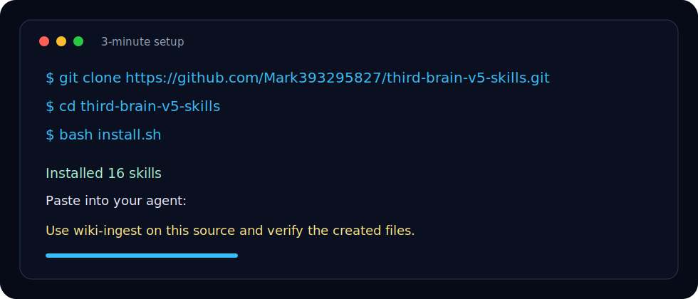

# Third Brain V5 Skills

<p align="center">
  
</p>

**Third Brain V5 — 17 production-ready Agent Skills for Claude, Codex, Gemini, Cursor, and Windsurf. Build a persistent Knowledge OS with Obsidian, behavior design, creativity loops, verification, full-stack agent harnesses, and multi-agent workflows.**

Install 17 ready-to-use Agent Skills for ingesting sources, building an interlinked wiki, running daily review loops, verifying claims, managing context cost, improving agent workflows, and orchestrating agent teams.

**Use this if your AI coding agent keeps forgetting context, making unverifiable "done" claims, or scattering useful knowledge across chats. Star it if you want a reusable, verification-first skill stack for long-running AI work.**

[](https://github.com/Mark393295827/third-brain-v5-skills/stargazers)
[](https://github.com/Mark393295827/third-brain-v5-skills/commits/main)
[](https://github.com/Mark393295827/third-brain-v5-skills/issues)
[](LICENSE)
[](https://claude.ai/code)
[](https://github.com/openai/codex)
[](https://github.com/google-gemini/gemini-cli)
[](docs/compatibility.md)
[](docs/compatibility.md)
[](GUIDE.md)
[](https://agentskills.io)
[](CONTRIBUTING.md)


---

## Visual Navigation

Open the local dashboard for a searchable skill map, workflow shortcuts, and cost tools:

```bash
# macOS
open tools/index.html

# Windows PowerShell
Start-Process tools/index.html
```

Quick links: [Visual Dashboard](tools/index.html) · [One-Click Test Prompt](examples/one-click-test-prompt.md) · [3-Minute Quickstart](examples/3-minute-quickstart.md)

Format standard: [Agent Skills Standard](docs/agent-skills-standard.md) · [Agentic Engineering Principles](docs/agentic-engineering-principles.md) · run `python tools/lint-agent-skills.py` before publishing skill changes.

## Quick Install



For Claude Code, Codex CLI, or Gemini CLI:

```bash
git clone https://github.com/Mark393295827/third-brain-v5-skills.git
cd third-brain-v5-skills
bash install.sh
```

Explicit targets:

```bash
bash install.sh codex
bash install.sh claude
bash install.sh gemini
bash install.sh cursor
bash install.sh windsurf
bash install.sh all
```

Manual install paths:

```bash
# Codex CLI
mkdir -p ~/.agents/skills && cp -r skills/* ~/.agents/skills/

# Claude Code
mkdir -p ~/.claude/skills && cp -r skills/* ~/.claude/skills/

# Gemini CLI
mkdir -p ~/.gemini/skills && cp -r skills/* ~/.gemini/skills/

# Cursor rules adapter
mkdir -p .cursor/rules && cp adapters/cursor/third-brain-skills.mdc .cursor/rules/

# Windsurf native workspace skills + routing rule
mkdir -p .windsurf/skills .windsurf/rules
cp -r skills/* .windsurf/skills/
cp adapters/windsurf/third-brain-skills.md .windsurf/rules/
```

## Try It

Paste one of these into your agent after installing:

```text
"I just read an interesting article. Ingest it into my wiki."
"Run my daily OKR."
"Cognitive compile on AI agent safety."
"Verify before I ship."
"Create an agent team to build a full-stack prototype."
```

One-click test prompt: [examples/one-click-test-prompt.md](examples/one-click-test-prompt.md).

## 3-Minute Quick Start

The fastest useful path is `wiki-ingest`: turn one article, PDF, transcript, or rough note into durable wiki knowledge. Treat this as the recommended first skill; add the rest only after the previous layer is producing evidence.

```text
Use wiki-ingest on this source.

Goal: turn it into reusable wiki knowledge, not a loose summary.

Create:
1. one immutable source note in `SOURCES_DIR` (default: `sources/`)
2. 3-7 key insights with source references
3. at least one concept page in `CONCEPTS_DIR` (default: `wiki/concepts/`)
4. relevant entity pages in `ENTITIES_DIR` (default: `wiki/entities/`)
5. links from the new pages to existing related pages when possible
6. a short log entry in `LOG_FILE` (default: `system/log.md`)

After writing files, run a quick verification:
- list created or updated files
- check each wiki page has at least two wikilinks
- state any claims that are single-source only
```

Full copyable workflow: [examples/3-minute-quickstart.md](examples/3-minute-quickstart.md).

## Skill Adoption Ladder

| Stage | Core skills | Upgrade when |
|---|---|---|
| Week 1: Start | `wiki-ingest` + `verify-before-claim` | You can ingest at least one source per day and every completion claim has fresh evidence. |
| Weeks 2-4: Daily loop | + `daily-okr` + `session-learn` | Daily OKR score is above 70% for a week and session learnings are being written back. |
| Month 2+: Deepen | + `cognitive-compile` + `behavior-design` + `creativity-engine` | The wiki has 50+ pages or repeated decisions need deeper synthesis and experiments. |
| Month 3+: Engineer | + `knowledge-ops` + `harness-engineering` + `agentic-engineering` | Retrieval, permissions, delegated actions, provenance, or workflow reliability become bottlenecks. |
| Multi-agent: Scale | + `agent-teams-command` + `project-flow-ops` | Work can be split into separate owners with clear integration and verification gates. |
| Strategy: Evaluate | + `startup-evaluation` + `anthropic-os` + `deep-research` | You need startup health, market, operating-system, or multi-source research decisions. |

## Before → After

| Use Case | Before | After |
|----------|--------|-------|
| Research PDF | A long PDF is summarized once and then forgotten. | `wiki-ingest` creates source notes, concept pages, entity pages, links, and a reusable brief. |
| Coding session | The agent says "fixed" without proof. | `verify-before-claim` requires a fresh command, exit code, and evidence before any completion claim. |
| Daily knowledge work | Inputs, ideas, and actions stay scattered across chat history. | `daily-okr` produces one insight, one wiki update, one action, one reusable output, and a daily score. |

## Demo & Tools

| Resource | What it shows |
|----------|---------------|
| [tools/index.html](tools/index.html) | Visual dashboard and skill navigation |
| [dashboard.html](dashboard.html) | Visual overview of the Third Brain V5 system |
| [tools/token-calculator.html](tools/token-calculator.html) | Token cost calculator |
| [tools/pipeline-cost-calculator.html](tools/pipeline-cost-calculator.html) | Pipeline cost estimator |
| [GUIDE.md](GUIDE.md) | Full installation, workflow, and troubleshooting guide |
| [examples/](examples/) | Copyable workflows and Obsidian entry note |
| [docs/compatibility.md](docs/compatibility.md) | Cursor, Windsurf, and other AI IDE setup |
| [docs/community-discovery.md](docs/community-discovery.md) | GitHub description, topics, and Awesome-list submission notes |
| [docs/github-star-growth-sprint.md](docs/github-star-growth-sprint.md) | 48-hour launch and Awesome-list growth sprint |

If this saves you time, consider starring the repo so others can discover it through GitHub search.

---

## Overview

These skills transform any AI coding agent into a **persistent knowledge compounding system**. Instead of treating each conversation as a one-off chat, these skills create an interlinked knowledge base that grows richer with every session — while also providing strategic execution frameworks inspired by Anthropic's work methods and Karpathy's Agentic Engineering.

### Agent Understanding Framework

Third Brain treats agents as LLM OS processes, not chat personas: the LLM is the CPU, context is RAM, Obsidian/wiki/logs are disk, tools are system calls, skills are executable programs, and the harness is the kernel that enforces permissions and observability. See [Agent Understanding Framework](wiki/concepts/agent-understanding-framework.md).

The latest engineering update adds a full-stack agent lens: agent workflows now account for IDE subagents, personal agents, agentic search, commerce mandates, generative-media provenance, and ambient-device privacy. See [Agentic Engineering Principles](docs/agentic-engineering-principles.md).

### Design Philosophy

| Layer | Principle | Skills |
|-------|-----------|--------|
| **🧠 Knowledge** | Capture, structure, and compound knowledge over time | wiki-ingest, knowledge-ops, wiki-lint |
| **⚡ Daily Loop** | Close the knowledge-to-action cycle every day | daily-okr, cognitive-compile |
| **🎯 Behavior & Creativity** | Turn knowledge into habits and novel ideas | behavior-design, creativity-engine |
| **🔬 Research & Quality** | Verify before claiming, research with rigor | deep-research, verify-before-claim |
| **🔄 Continuous Learning** | Extract patterns from every session | session-learn, project-flow-ops |
| **📊 Context & Cost** | Manage the LLM's scarcest resource | context-manager, token-cost-tracker |
| **🏗️ Engineering** | Design agent workflows, infrastructure, and multi-agent teams | agentic-engineering, harness-engineering, agent-teams-command |
| **💼 Strategy** | Evaluate startups, adopt Anthropic-level methods | startup-evaluation, anthropic-os |

---

## Skills

### 📥 Ingestion & Knowledge

| Skill | Description |
|-------|-------------|
| [wiki-ingest](skills/wiki-ingest/SKILL.md) | Ingest sources (articles, PDFs, videos) into a persistent interlinked wiki. Creates source notes, entity pages, concept pages, updates navigation. STOW pipeline. |
| [knowledge-ops](skills/knowledge-ops/SKILL.md) | Multi-layer knowledge management — classify, deduplicate, vectorize with ChromaDB, sync across stores. |
| [wiki-lint](skills/wiki-lint/SKILL.md) | Health-check the wiki across 8 dimensions: frontmatter, links, orphans, stale content, contradictions, drift. |

### 🔄 Daily Workflow

| Skill | Description |
|-------|-------------|
| [daily-okr](skills/daily-okr/SKILL.md) | Daily knowledge compound closed loop — 7 Key Results from input to feedback, with scoring. Includes Stop Doing List (Buffett/Munger). |
| [cognitive-compile](skills/cognitive-compile/SKILL.md) | Deep learning 8-section framework: Question → Facts → Concepts → Pattern Recognition → Conflict Detection → Hypothesis Generation → Decision Support → Action. |

### 🎨 Behavior & Creativity

| Skill | Description |
|-------|-------------|
| [behavior-design](skills/behavior-design/SKILL.md) | Transform goals into behavior systems. Decompose → minimum habits → triggers → SOPs → review. Includes HAS (Human Agency Scale) from Stanford research. |
| [creativity-engine](skills/creativity-engine/SKILL.md) | Generate novel ideas via combinatorial creativity. Lego Building Blocks method (Andrew Ng), cross-domain analogies, minimum experiments. |

### 🔬 Research & Quality

| Skill | Description |
|-------|-------------|
| [deep-research](skills/deep-research/SKILL.md) | Multi-source deep research with confidence-based evidence standards. |
| [verify-before-claim](skills/verify-before-claim/SKILL.md) | Iron rule: No completion claims without fresh verification evidence. Includes expected value thinking from poker psychology. |

### 🔄 Learning & Flow

| Skill | Description |
|-------|-------------|
| [session-learn](skills/session-learn/SKILL.md) | Extract knowledge patterns from sessions — 7 signal types (concepts, entities, corrections, patterns, ideas, decisions, gaps). Closure Protocol included. |
| [project-flow-ops](skills/project-flow-ops/SKILL.md) | Execution flow — triage, plan, track, review across projects. |

### 📊 Context & Cost

| Skill | Description |
|-------|-------------|
| [context-manager](skills/context-manager/SKILL.md) | Manage the LLM's context window — token budgeting, prompt assembly, truncation strategies. Concrete Ideas framework (Andrew Ng) + Tokenmaxxing vs Efficiency (Gary Tan). |
| [token-cost-tracker](commands/token-cost-tracker.md) | Estimate, log, and report token usage. Built-in Python logger script. |

### 🏗️ Engineering

| Skill | Description |
|-------|-------------|
| [agentic-engineering](skills/agentic-engineering/SKILL.md) | Refactor workflows into spec-driven macro actions with quality ceilings, delegated-action boundaries, verification gates, state checkpoints, and write-back. |
| [harness-engineering](skills/harness-engineering/SKILL.md) | Design runtime infrastructure around AI agents — permissions, system-call tools, delegated-action gates, provenance, observability, recovery, and adversarial review. |
| [agent-teams-command](skills/agent-teams-command/SKILL.md) | Command multi-agent macro actions with ownership, IPC, async budget envelopes, integration joins, cleanup, evidence gates, and red-team review for high-risk work. |

### 💼 Strategy

| Skill | Description |
|-------|-------------|
| [startup-evaluation](skills/startup-evaluation/SKILL.md) | Evaluate startup health with entrepreneurship, VC 5T, PMF, runway, team, unit economics, and next-cheapest-test diagnostics. |
| [anthropic-os](skills/anthropic-os/SKILL.md) | Anthropic OS — Self-Evolving Work Method Engine. CASH growth system, 70/30 rule, two-week rule, hive mind, working backwards. Built-in self-evolution mechanism. |

---

## Architecture

```
┌──────────────────────────────────────────────────────────────────────────┐
│                      Karpathy LLM OS Layer                                │
│  LLM=CPU │ Context=RAM │ Storage=Disk │ Tools=System Calls                │
│  Skills=Programs │ Harness=Kernel │ Agent Teams=Processes                 │
│  ┌──────────────────────────────────────────────────────────────────┐    │
│  │ context-manager: Token Budget → Prompt Assembly → Truncation     │    │
│  │ token-cost-tracker: Estimate → Log → Report                     │    │
│  └──────────────────────────────────────────────────────────────────┘    │
└──────────────────────────────────────────────────────────────────────────┘
                                    │
                         ┌──────────┴──────────┐
                         ▼                     ▼
              ┌──────────────────┐   ┌──────────────────────┐
              │   External       │   │   Agent Teams        │
              │   Sources        │   │   (Parallel Fleet)    │
              └────────┬─────────┘   └──────────────────────┘
                       ▼
         ┌──────────────────────────────┐
         │   wiki-ingest + knowledge-ops│
         │   (STOW pipeline + RAG sync) │
         └──────┬──────────┬────────────┘
                │          │
         ┌──────▼          └──────────────┐
         │  Knowledge Layers               │
         │  ├ Active (GitHub/Linear)       │
         │  ├ Memory (quick access)        │
         │  ├ Wiki (durable, interlinked)  │
         │  ├ Vector (ChromaDB, semantic)  │
         │  └ External (DBs, APIs)         │
         └────────────────────────────────┘
                │
    ┌───────────┼──────────┬──────────────┬──────────────┐
    ▼           ▼          ▼              ▼              ▼
┌─────────┐ ┌─────────┐ ┌──────────┐ ┌───────────┐ ┌──────────┐
│ daily   │ │cognitive│ │ behavior │ │ creativity│ │ project  │
│ -okr    │ │-compile │ │ -design  │ │ -engine   │ │ -flow-ops│
└─────────┘ └─────────┘ └──────────┘ └───────────┘ └──────────┘
    │           │          │              │              │
    └───────────┼──────────┼──────────────┼──────────────┘
                ▼
    ┌─────────────────────────────────────────────────────────────┐
    │ session-learn (+Closure Protocol)  ← feedback loop          │
    │ verify-before-claim               ← quality gate            │
    │ wiki-lint                         ← health check            │
    │ deep-research                     ← synthesis               │
    │ harness-engineering               ← safety + multi-agent    │
    │ agent-teams-command               ← fleet command           │
    │ startup-evaluation                ← VC evaluation           │
    │ anthropic-os                      ← work method engine      │
    └─────────────────────────────────────────────────────────────┘
```

---

## Quick Start

For detailed installation, usage, and 5 complete workflow scenarios, see the **[Full Guide](GUIDE.md)**.

### Clone

```bash
git clone https://github.com/Mark393295827/third-brain-v5-skills.git
cd third-brain-v5-skills
bash install.sh
```

### Claude Code

```bash
# Personal skills (available across all projects)
cp -r third-brain-v5-skills/skills/* ~/.claude/skills/

# Project skills (shared with team)
cp -r third-brain-v5-skills/skills/* .claude/skills/
```

### Codex CLI

```bash
cp -r third-brain-v5-skills/skills/* ~/.agents/skills/
```

### Gemini CLI

```bash
cp -r third-brain-v5-skills/skills/* ~/.gemini/skills/
```

### Try It

```
"I just read an interesting article — ingest it into my wiki."
"Run my daily OKR."
"Cognitive compile on AI Agent safety."
"Design a reading habit."
"Generate 10 business ideas from my wiki."
"Extract what we learned this session."
"Verify before I ship."
"Lint my wiki."
"Create an agent team to build a full-stack app."
"Launch Anthropic OS for my team's growth."
```

---

## Command Reference

| Command | File | Usage |
|---------|------|-------|
| `token-cost-tracker estimate` | [token-cost-tracker.md](commands/token-cost-tracker.md) | Estimate token cost before a task |
| `token-cost-tracker log` | [token-cost-tracker.md](commands/token-cost-tracker.md) | Log actual token usage |
| `token-cost-tracker report` | [token-cost-tracker.md](commands/token-cost-tracker.md) | Weekly/monthly cost report |

---

## Wiki Structure

These skills use `system/config.md` as the default path contract. The layout below is the default, not a hard requirement; override it in your local `system/config.md`, `CLAUDE.md`, or equivalent agent rules file if your Obsidian vault already uses different folders.

```
sources/          ← Immutable source notes (articles, books, reports)
wiki/
├── concepts/     ← Ideas, frameworks, methods
├── entities/     ← People, companies, products
├── atomic-notes/ ← Single knowledge atoms
├── outputs/      ← Reusable outputs (reports, analyses, evaluations)
├── decisions/    ← Architecture and strategy decisions
└── sops/         ← Standard operating procedures
maps/             ← Navigation / Maps of Content
system/           ← Schema, log, templates, lint reports
08_behaviors/     ← Behavior system (goals, habits, SOPs, reviews)
09_creativity/    ← Creativity system (ideas, experiments, prototypes)
```

Path config: [system/config.md](system/config.md).

---

## Related Projects

- [Agent Skills](https://agentskills.io) — Open format specification
- [llm-wiki-agent](https://github.com/SamurAIGPT/llm-wiki-agent) — Original STOW pattern implementation

## Contributing

Bug reports, skill requests, and small PRs are welcome. See [CONTRIBUTING.md](CONTRIBUTING.md), [CHANGELOG.md](CHANGELOG.md), and the [release playbook](docs/release-playbook.md) for the weekly feedback loop and release checklist.

## License

MIT — see [LICENSE](LICENSE).
