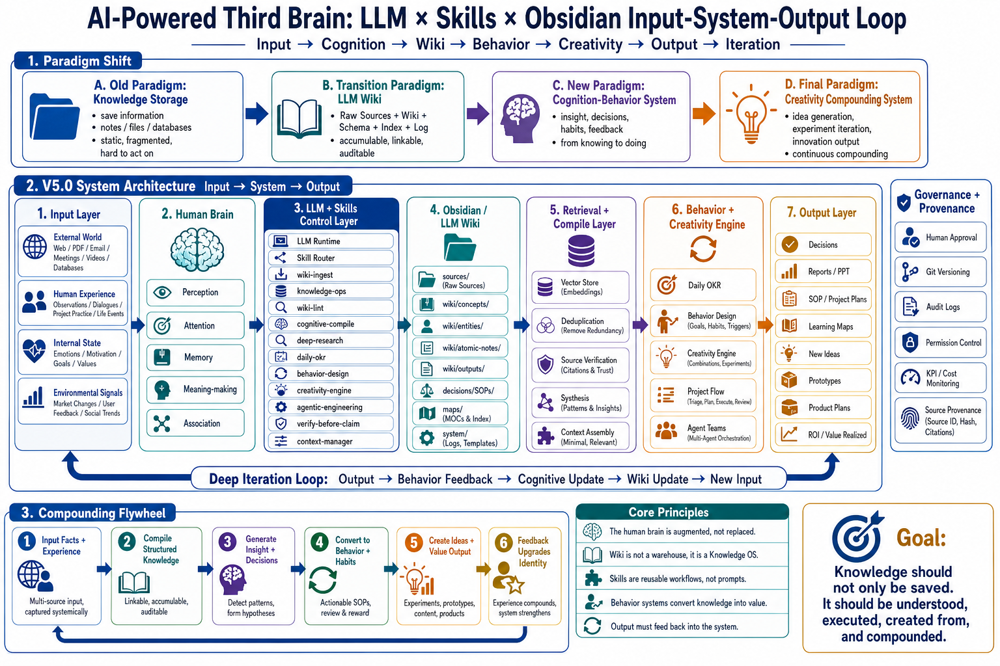

# Third Brain V6 Skills

<p align="center">
  
</p>

**Production-ready Agent Skills for Claude Code, Codex, Gemini, Cursor, and Windsurf.** Build a persistent knowledge operating system with verification-first workflows, Obsidian provenance, scheduled loops, context management, and multi-agent orchestration.

Install 19 reusable agent skills for ingesting sources, compiling interlinked wikis, running daily knowledge loops, verifying claims before shipping, managing token costs, engineering bounded agent loops, and orchestrating multi-agent teams.

**Use this if:**
- Your AI agent keeps forgetting context between sessions
- You want to enforce verification gates before "done" claims
- You need to structure knowledge as linked pages (like Obsidian) instead of scattered chat history
- You're building agent workflows that should learn and compound over time
- You want Obsidian wiki knowledge to update skills, SOPs, schemas, and automation through supervised promotion gates

[](https://github.com/Mark393295827/third-brain-v5-skills/stargazers)
[](LICENSE)
[](https://claude.ai/code)
[](GUIDE.md)
[](CONTRIBUTING.md)

---

## Quick Start

### 1. Clone & Install

```bash
git clone https://github.com/Mark393295827/third-brain-v5-skills.git
cd third-brain-v5-skills
bash install.sh claude  # or: codex, gemini, cursor, windsurf, all
```

### 2. Try a Skill

Paste this into Claude Code or your agent:

```text
Use wiki-ingest on this source. Create source notes, concept pages, entity pages, navigation updates, and a verification summary.
```

Then paste a URL, article, PDF text, or any source you want to capture.

### 3. Next Steps

See the **[3-Minute Quickstart](examples/3-minute-quickstart.md)** for a complete walkthrough.

Full guide: **[GUIDE.md](GUIDE.md)**

---

## The Problem

| Scenario | Before | After |
|----------|--------|-------|
| **Research PDF** | Summarized once, then forgotten | `wiki-ingest`: source notes, concept pages, linked wiki |
| **Coding session** | Agent: "I fixed it" (no proof) | `verify-before-claim`: requires test output + exit code before any claim |
| **Daily work** | Tasks and ideas scatter across chat | `daily-okr`: one insight, one wiki update, one action, one output, daily score |

---

## V6 Operating Model

V6 treats the wiki as the agent's durable disk and governance layer:

```text
Input -> Source -> Wiki compile -> Daily loop -> Agent/Wiki flywheel -> Skill/SOP upgrade -> Verification
```

The upgrade adds six hard defaults:

- **Source provenance stays immutable**: raw source notes and block refs remain the audit layer.
- **Loops have contracts**: Trigger -> Execute -> Verify -> State, with budgets and recovery.
- **Context is zero-overhead by default**: hot paths load only what the task needs.
- **Automation is bounded**: scans and queues can run unattended; semantic writes stay supervised.
- **Teams need ownership**: multi-agent work requires write scopes, IPC, join gates, cleanup, and evidence.
- **Rules promote through evidence**: wiki insights become schema or skill rules only after repeated support and a cheap check.

See [V6 release notes](docs/release-notes-v6.md).

---

## Core Skills (Start Here)

### 🧠 **Knowledge & Verification**

| Skill | What it does |
|-------|-------------|
| **[wiki-ingest](skills/wiki-ingest/SKILL.md)** | Capture sources (articles, PDFs, transcripts) into an interlinked wiki with source references, concept pages, and entity pages. Enforces the V6 source-to-skill promotion gate so pages explain *why* something matters and when it can change future agent behavior. |
| **[verify-before-claim](skills/verify-before-claim/SKILL.md)** | **Iron rule**: No completion claims without fresh verification evidence. Run the proof command, show the output, then claim. Prevents "should work" hallucinations. Uses poker psychology (expected value thinking) to distinguish process from outcomes. |

### 📅 **Daily Loop**

| Skill | What it does |
|-------|-------------|
| **[daily-okr](skills/daily-okr/SKILL.md)** | Execute a 7-KR cycle: Input → Cognition → Wiki → Behavior → Creativity → Output → Feedback. Includes **Stop Doing List** (Buffett/Munger) to identify what NOT to do. Score: 3=starting, 5=minimal loop, 7=quality, 10=flywheel. |

### 🎯 **Behavior & Creativity**

| Skill | What it does |
|-------|-------------|
| **[behavior-design](skills/behavior-design/SKILL.md)** | Turn goals into habit systems. Decompose → minimum habits → triggers → SOPs → review. Includes Human Agency Scale (HAS) from BJ Fogg. |
| **[creativity-engine](skills/creativity-engine/SKILL.md)** | Generate novel ideas via combinatorial creativity. Lego Building Blocks method (Andrew Ng), cross-domain analogies, minimum experiments. |

### 🔬 **Research & Quality**

| Skill | What it does |
|-------|-------------|
| **[deep-research](skills/deep-research/SKILL.md)** | STOW-compatible research harness with evidence trails, source/claim ledgers, privacy checks, and direct handoff to wiki-ingest. |
| **[session-learn](skills/session-learn/SKILL.md)** | Extract knowledge patterns from sessions — concepts, entities, corrections, patterns, ideas, decisions, gaps. Closure protocol ensures learning feeds back into the wiki. |

### 📊 **Context & Engineering**

| Skill | What it does |
|-------|-------------|
| **[context-manager](skills/context-manager/SKILL.md)** | Manage LLM context window — token budgeting, prompt assembly, truncation strategies using Concrete Ideas framework (Andrew Ng) + Tokenmax techniques. |
| **[loop-engineering](skills/loop-engineering/SKILL.md)** | Turn repeatable tasks into bounded agent loops with a durable contract, independent verifier, hard budgets, explicit stop/recovery rules, and conservative topology selection. |
| **[agentic-engineering](skills/agentic-engineering/SKILL.md)** | Design agent workflows as spec-driven macro actions with quality ceilings, verification gates, delegated-action boundaries, and state checkpoints. |
| **[agent-teams-command](skills/agent-teams-command/SKILL.md)** | Orchestrate multi-agent fleets — ownership, IPC, async budget envelopes, integration joins, evidence gates. |

---

## Complete Skill List

### 📥 Ingestion & Knowledge

- `wiki-ingest` — Ingest sources with source-risk taxonomy, Karpathy understanding gate, concept/entity pages, wikilinks
- `knowledge-ops` — Multi-layer knowledge management: classify, deduplicate, preserve evidence hierarchy, vector + Markdown retrieval
- `wiki-lint` — Health check: P0/P1 graph health, frontmatter, source refs, wikilink density, provenance debt

### 🔄 Daily Workflow

- `daily-okr` — 7-KR closed loop with Stop Doing List (Buffett/Munger), daily score
- `cognitive-compile` — 8-section framework: Question → Facts → Concepts → Pattern Recognition → Conflict Detection → Hypothesis Generation

### 🎨 Behavior & Creativity

- `behavior-design` — Goals → habits → triggers → SOPs → review (HAS framework)
- `creativity-engine` — Combinatorial creativity: Lego Building Blocks, cross-domain analogies, minimum tests

### 🔬 Research & Quality

- `deep-research` — STOW-compatible research harness, evidence trails, source/claim ledgers
- `verify-before-claim` — Verification gates, poker psychology (expected value), red-flag detection

### 🔄 Learning & Flow

- `session-learn` — 7 signal types: concepts, entities, corrections, patterns, ideas, decisions, gaps
- `project-flow-ops` — Execution flow: triage, plan, track, review across projects

### 📊 Context & Cost

- `context-manager` — Token budgeting, prompt assembly, truncation strategies
- `token-cost-tracker` — Estimate, log, report token usage with built-in Python logger

### 🏗️ Engineering

- `loop-engineering` — Bounded loop contracts, independent verification, finite budgets, stop/recovery rules, and topology selection
- `agentic-engineering` — Spec-driven macro actions, quality ceilings, verification gates, state checks
- `harness-engineering` — Runtime infrastructure: permissions, system-call tools, delegated gates, provenance, observability
- `agent-teams-command` — Multi-agent orchestration: ownership, IPC, async budgets, evidence gates

### 💼 Strategy & Operations

- `startup-evaluation` — Startup health: entrepreneurship, VC 5T, PMF, runway, team, unit economics
- `anthropic-os` — Self-evolving work method engine: CASH growth, 70/30 rule, two-week rule, working backwards
- `ai-six-sigma-property-os` — AI + Ontology + DMAIC for property work orders, dispatch, quotes, evidence

---

## How These Skills Fit Together

```
                        LLM (CPU) + Context (RAM) + Wiki (Disk)

External Sources ──→ wiki-ingest + knowledge-ops ──→ Knowledge Layers
                            ↓
                    Daily Loop (daily-okr)
                    /    /    \    \    \
               Input  Cognition  Wiki  Behavior  Creativity
                            |
                        Output → Feedback
                            ↓
                    session-learn (extract patterns)
                            ↓
                    verify-before-claim (quality gate)
                            ↓
                Multi-agent teams (agentic-engineering)
```

The system is a **closed loop**: ingest sources → process daily → extract learning → verify claims → promote rules → scale to teams.

---

## Architecture & Design

**Third Brain V6 treats agents as LLM OS processes:**
- LLM = CPU
- Context = RAM
- Wiki/Obsidian = Disk
- Tools = System calls
- Skills = Executable programs
- Harness = Kernel
- Agent teams = Processes

### Design Layers

| Layer | Principle | Skills |
|-------|-----------|--------|
| **🧠 Knowledge OS** | Capture, structure, lint, and promote knowledge over time | wiki-ingest, knowledge-ops, wiki-lint |
| **⚡ Daily Loop** | Close the knowledge-to-action cycle every day | daily-okr, cognitive-compile |
| **🎯 Behavior & Creativity** | Turn knowledge into habits and novel ideas | behavior-design, creativity-engine |
| **🔬 Research & Quality** | Verify before claiming, research with rigor | deep-research, verify-before-claim |
| **🔄 Continuous Learning** | Extract patterns from every session | session-learn, project-flow-ops |
| **📊 Context & Cost** | Manage the LLM's scarcest resource | context-manager, token-cost-tracker |
| **🏗️ Engineering** | Design bounded loops, harnesses, agent workflows, and multi-agent systems | loop-engineering, agentic-engineering, harness-engineering, agent-teams-command |
| **💼 Strategy & Operations** | Evaluate startups, design AI quality systems | startup-evaluation, anthropic-os, ai-six-sigma-property-os |

---

## Skill Adoption Path

Start small. Add skills as you need them.

| Stage | Core Skills | Unlock When |
|-------|------------|-------------|
| **Week 1** | `wiki-ingest` + `verify-before-claim` | You can ingest 1 source/day + every claim has fresh evidence |
| **Weeks 2-4** | + `daily-okr` + `session-learn` | Daily OKR score >70% for a week, learnings feed back to wiki |
| **Month 2+** | + `cognitive-compile` + `behavior-design` + `creativity-engine` | Wiki has 50+ pages or repeated decisions need synthesis |
| **Month 3+** | + `knowledge-ops` + `loop-engineering` + `harness-engineering` + `agentic-engineering` | Retrieval, looping reliability, permissions, or delegated actions become bottlenecks |
| **Multi-agent** | + `agent-teams-command` + `project-flow-ops` | Work splits into separate owners with clear integration gates |
| **Strategy** | + `startup-evaluation` + `anthropic-os` + `deep-research` | Need startup health, market, operating-system decisions |
| **Operations** | + `ai-six-sigma-property-os` | Need measurable service quality, dispatch, evidence loops |

---

## Installation

### For Claude Code

```bash
# Personal skills (available across all projects)
cp -r skills/* ~/.claude/skills/

# Project skills (shared with team)
cp -r skills/* .claude/skills/
```

### For Cursor

```bash
mkdir -p .cursor/rules && cp adapters/cursor/third-brain-skills.mdc .cursor/rules/
```

### For Windsurf

```bash
mkdir -p .windsurf/skills .windsurf/rules
cp -r skills/* .windsurf/skills/
cp adapters/windsurf/third-brain-skills.md .windsurf/rules/
```

### For Codex CLI / Gemini CLI

```bash
cp -r skills/* ~/.agents/skills/  # Codex
cp -r skills/* ~/.gemini/skills/  # Gemini
```

Full guide: **[GUIDE.md](GUIDE.md)**

---

## Example Workflows

Each workflow is copyable into your agent. See **[examples/](examples/)** for complete, verified examples:

- [3-minute quickstart](examples/3-minute-quickstart.md) — Fastest path to useful output
- [Research PDF to wiki](examples/research-pdf-to-wiki.md) — Turn a source into linked pages
- [Verified code session](examples/verified-code-session.md) — Use verification gates before claiming a fix
- [Daily knowledge loop](examples/daily-knowledge-loop.md) — Run a compact daily OKR workflow
- [Startup evaluation sprint](examples/startup-evaluation-sprint.md) — Turn an idea into validated assumptions

---

## Wiki Structure

Skills default to STOW paths (configurable via `system/config.md`):

```
sources/          ← Immutable source notes (articles, PDFs, transcripts)
wiki/
├── concepts/     ← Ideas, frameworks, methods
├── entities/     ← People, companies, products
├── atomic-notes/ ← Single-fact notes
├── outputs/      ← Reusable reports, analyses
├── decisions/    ← Architecture decisions
└── sops/         ← Standard operating procedures
system/           ← Config, log, schema, templates
08_behaviors/     ← Behavior system (goals, habits, reviews)
09_creativity/    ← Creativity system (ideas, experiments)
```

---

## Tools & References

| Resource | Purpose |
|----------|---------|
| [tools/index.html](tools/index.html) | Visual skill navigator and dashboard |
| [tools/token-calculator.html](tools/token-calculator.html) | Token cost calculator |
| [GUIDE.md](GUIDE.md) | Full installation & troubleshooting |
| [CLAUDE.md](CLAUDE.md) | Claude Code setup |
| [CONTRIBUTING.md](CONTRIBUTING.md) | How to contribute skills |

---

## What This Is NOT

- **Not a chat wrapper.** Skills are executable prompts that agents follow; they're not productivity theater.
- **Not a productivity tool with 100 metrics.** Daily OKR has 7 KRs; that's it. Scoring is 3/5/7/10, not a complex formula.
- **Not an all-in-one framework.** Pick skills incrementally. You don't need all 18 to start.
- **Not prescriptive.** Adapt paths, frontmatter, and skill triggers to your workflow.

---

## Philosophy

**Three core principles:**

1. **Verification first**: No "done" without proof. No claims without evidence. Expected value over confidence.
2. **Knowledge compounds**: Every session should improve the wiki, not scatter across chat history.
3. **Closed loops**: Ingest → Process → Learn → Scale → Verify. No loose ends.

---

## Related Work

- [Agent Skills Format](https://agentskills.io) — Open specification for agent skills
- [llm-wiki-agent](https://github.com/SamurAIGPT/llm-wiki-agent) — Original STOW pattern implementation by SamurAIGPT
- [Karpathy LLM OS](https://karpathy.ai) — Conceptual framework

---

## Contributing

Bug reports, skill improvements, and PRs are welcome. See [CONTRIBUTING.md](CONTRIBUTING.md) and [CHANGELOG.md](CHANGELOG.md).

---

## License

MIT — see [LICENSE](LICENSE).

---

## Transparency Note

This project includes **growth and outreach tools** (in `tools/` and `outreach/`) designed to help the repository reach users via GitHub search and Awesome lists. These tools are optional, dry-run-by-default, and separate from the core skills. If you're installing skills for your own workflow, you don't need them.

The skill frameworks and philosophy are genuine. Use what works for you; ignore what doesn't.
